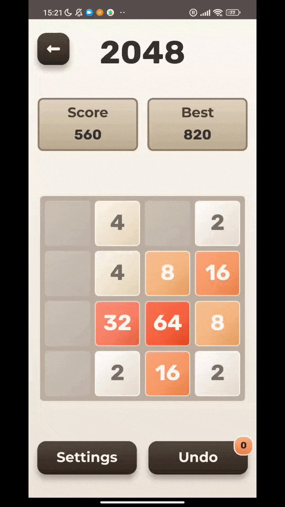
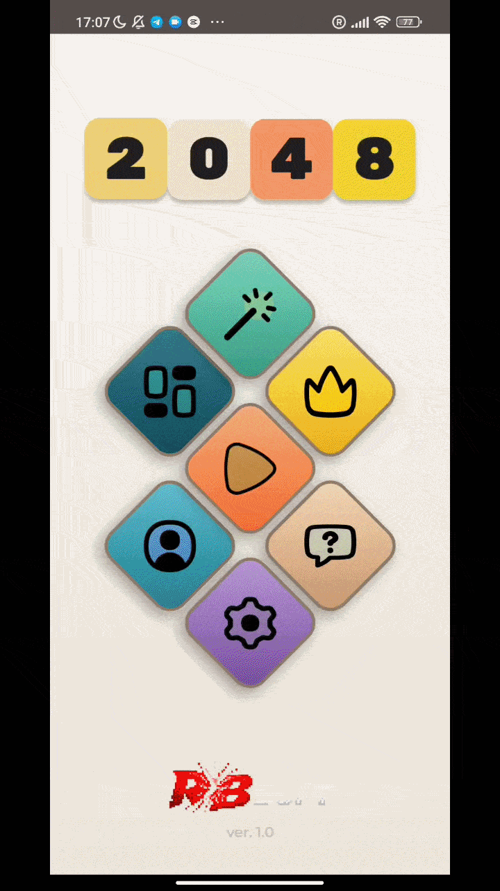
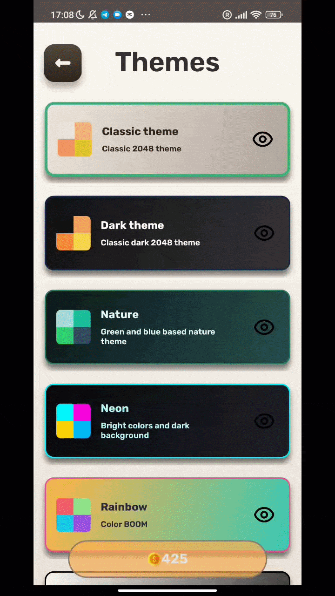
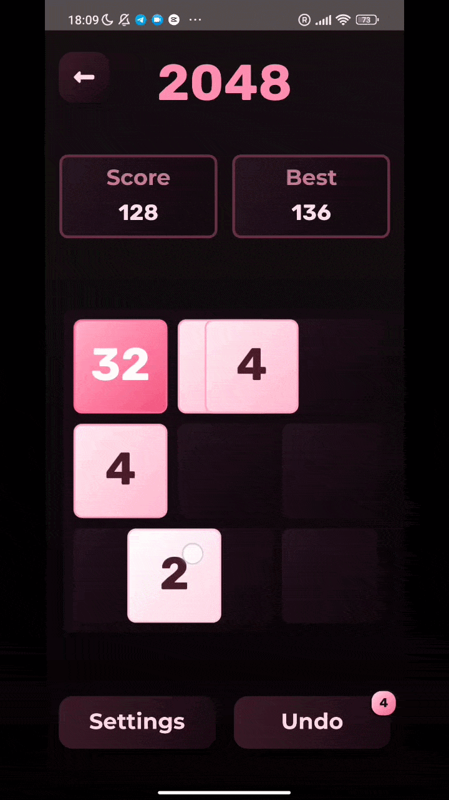
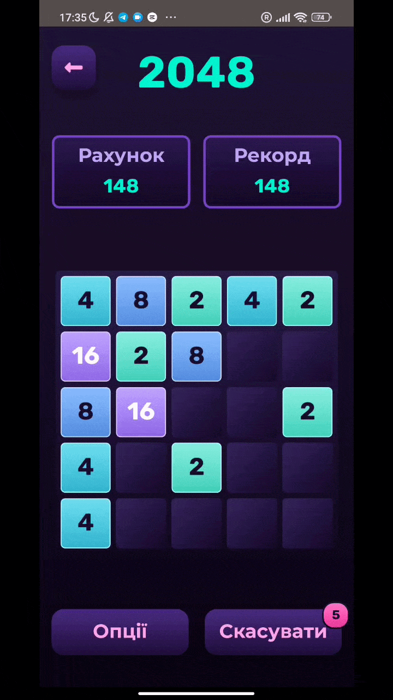

<div align="center">
  
# Game 2048 


> *A modern, cross-platform implementation of the classic 2048 puzzle game, built with .NET MAUI and scalable architecture.*

[](#)

</div>

## 1. About the Project :information_source:

This project represents a fresh and reimagined version of the classic puzzle game 2048. The core objective remains the same: move tiles on a grid, merge them to get a higher value tile and try to reach tile 2048. However, this project features different game modes, undo options, colorful theme customization, profile statistics and local achievements system. Game2048 is powered by a robust, scalable engine decoupled from the UI, designed to be flexible and work seamlessly with different UI providers.

>[!NOTE]
>To got to run & build section:
>* [Run on Android](#iphone-android)
>* [Run on iOS](#green_apple-ios)
>* [Run on Windows](#desktop_computer-windows)

## 2. Screenshots & Gameplay :video_game:

<div align="center">



<p><em>Dynamic tile animations, undo mechanics, and score tracking</em></p>

<br>

<details>
<summary><b>See more gameplay (click to expand)</b></summary>
<br>

<table>
  <tr>
    <td align="center" width="50%" valign="top">
      
      <br>
      <sub><em>Wide selection for customization</em></sub>
    </td>
    <td align="center" width="50%" valign="top">
      
      <br>
      <sub><em>Different gaming experience</em></sub>
    </td>
  </tr>
  
  <tr>
    <td align="center" width="50%" valign="top">
      
      <br>
      <sub><em>Compact 3x3 mode</em></sub>
    </td>
    <td align="center" width="50%" valign="top">
      
      <br>
      <sub><em>Chill 5x5 mode</em></sub>
    </td>
  </tr>
</table>

</details>

</div>

## 3. Key Features :sparkles:

* **Clean & Deterministic Engine:** UI-agnostic C# core with predictable, fully unit-testable game logic.
* **Undo & State Persistence:** Rewind moves, restore game states, and automatically persist ongoing sessions and player progress.
* **Dynamic Theming Engine:** Hot-swappable XAML resource dictionaries featuring custom visual palettes and an experimental numberless mode.
* **Fluid UI & Animations:** Coordinate-based tile layout with smooth sliding, spawn scaling, and merge bounce feedback.
* **Meta Progression & Profiles:** Lifetime player statistics tracking, high scores, and an offline achievement system.
* **Game Modes & Localization:** Multiple grid variations (3x3, 4x4, 5x5) and built-in runtime localization for 4 languages.
* **Cross-Platform Support:** Single shared C# codebase targeting Android, iOS, and Windows.

## 4. Architecture & Technical Design :hammer_and_wrench:

The solution separates game logic from presentation layer through a decoupled **MVVM** pattern and Clean Architecture principles:

```text
Game2048/
├── Game2048.Core/                  # UI-Agnostic Domain & Game Engine
│   ├── DTOs/                       # Data transfer objects for external communication
│   ├── Enums/                      # Domain enumerations
│   ├── Factories/                  # Public factories to create Game.cs instances
│   ├── Interfaces/                 # Abstractions for Dependency Injection
│   ├── Logic/                      # Analyzer for identifying move types
│   ├── Mechanics/                  # Core matrix algorithms and move validation
│   ├── Models/                     # Immutable entities and snapshot models
│   └── Services/                   # DI implementations for business logic
│
└── Game2048.Maui/                  # .NET MAUI Presentation Layer
    ├── Achievements/               # Modular achievements engine (Checkers & Services)
    ├── Constants/                  # Layout math, constants for measures
    ├── Enums/                      # UI-related enumerations
    ├── Interfaces/                 # Abstractions for Dependency Injection
    ├── Resources/                  # Multi-language .resx tables, XAML Themes and images
    ├── Services/                   # DI implementations (settings, themes manager etc.)
    ├── ViewModels/                 # Presentation state and commands
    └── Views/                      
        ├── Components/             # Reusable UI controls (e.g., Custom TileView)
        ├── Overlays/               # Custom modal popups (Game Over, Settings etc.)
        └── Pages/                  # Shell routing destinations (GamePage, MainMenu)
```
>[!TIP]
>For more details on the architecture and game logic, explore the modules below:
>* **:brain: Game2048.Core:** Read about the core game mechanics and state management in [Core](./Game2048.Core/).
>* **:eye: Game2048.Maui:** Learn more about the UI layer and MVVM setup in [Maui](./Game2048.Maui/).

>[!NOTE]
>Additionally, the repository includes:
>* **:test_tube: Unit tests:** Check out the [Core Test Project](./Game2048.Core.Test/) for coverage details.
>* **:computer: Console UI:** A runnable [console application](./Game2048.ConsoleApp/) built with [Spectre.Console](https://github.com/spectreconsole/spectre.console) for testing the game engine in a UI-agnostic environment.

## 5. Getting Started & Build Instructions :rocket:

### :iphone: Android
To test this project on Android OS, you can go two ways:
* The easiest one is to [get it on Google Play]()
* The second option is to compile the project in your own environment following those steps:

#### Prerequisites

* [.NET 10 SDK](https://dotnet.microsoft.com/en-us/download/dotnet/10.0)
* [Visual Studio 2026](https://visualstudio.microsoft.com/ru/downloads/) (recommended) or Visual Studio Code with .NET MAUI extension.
* Android SDK (API 21+ / Target SDK 36).
* Android phone or Android Emulator (API 21+, API 36 Recommended)

#### Prepare the phone

* If you use a physical Android device, make sure you switch it to developer mode and turn on the USB installation.
>[!TIP]
>Check out [this instructions](https://developer.android.com/studio/debug/dev-options?hl=en) for more details about developer mode on Android.
* Connect the phone with USB cable to your PC and accept the storage access.
> [!NOTE]
> If you run it on Android Emulator make sure to enable hardware acceleration for smooth performance. Go to `Turn Windows features on or off` and enable `Hyper-V` or `Windows Hypervisor Platform` (depending on your CPU). Without this, the emulator might fail to start or run extremely slow. You might also need to turn this options in BIOS. More information can be found [here](https://developer.android.com/studio/run/emulator-acceleration?hl=en)

#### Build & Run

1. **Clone the repository:**
   ```bash
   git clone https://github.com/Denys-Sheremet/Game2048.git
   cd Game2048/Game2048.Maui
   ```

2. **Install/Restore MAUI workloads**
   ```bash
   dotnet workload install maui
   ```

3. **Restore .NET NuGet packages**
   ```bash
   dotnet restore
   ```

4. **Deploy & run on a connected device / emulator**
   Via CLI:
   ```bash
   dotnet build Game2048.Maui/Game2048.Maui.csproj -t:Run -f net10.0-android -c Release
   ```
   
   Via Visual Studio:
   * Set Game2048.Maui as a Startup Project
   * Set solution's configuration to Release
   * Choose either local Android devices > your device or Android emulators > your emulator
   * Click Run without debug or `Ctrl + F5`

### :green_apple: iOS

>[!IMPORTANT]
>The iOS build is currently unverified. The codebase is fully cross-platform and ready for Apple devices, but this target has not been successfully compiled and tested locally yet due to environment constraints.
>If you have a macOS environment with Xcode configured, you can build the project using the standard .NET MAUI workflow.

#### Prerequisites

* macOS machine (MacBook, Mac Mini, etc.)
* [.NET 10 SDK](https://dotnet.microsoft.com/en-us/download/dotnet/10.0)
* Xcode (latest version available on the Mac App Store)
* Visual Studio Code with .NET MAUI extension or JetBrains Rider
* Apple Developer Account (free or paid) for provisioning profiles

#### Prepare phone (Physical Device)

* Connect your iPhone to the Mac via USB cable and tap **Trust** on the device screen.
* Open Xcode, navigate to `Window > Devices and Simulators`, and wait for your device to be recognized and paired. 
* Enable **Developer Mode** on your iPhone (`Settings > Privacy & Security > Developer Mode`) and restart the device when prompted.
>[!TIP]
>If the Developer Mode option is missing in settings, create a blank dummy project in Xcode, select your iPhone as the target destination, and hit "Run". This will forcefully trigger the option to appear.
* **Trust the Developer:** If you are using a free Apple Developer account, iOS will block the app from launching the first time. Go to `Settings > General > VPN & Device Management` on your iPhone, tap your Apple ID under "Developer App", and select **Trust**.

#### Build & Run

1. **Clone the repository:**
  ```bash
  git clone https://github.com/Denys-Sheremet/Game2048.git
  cd Game2048/Game2048.Maui
  ```

2. **Install/Restore MAUI workloads**
   ```bash
   dotnet workload install maui-ios
   ```

3. **Restore .NET NuGet packages**
   ```bash
   dotnet restore
   ```

4. **Deploy & run on a connected device / emulator**
   Via CLI:
   ```bash
   dotnet build Game2048.Maui/Game2048.Maui.csproj -t:Run -f net10.0-ios -c Release
   ```

   Via Visual Studio Code:
   * Ensure the .NET MAUI extension is installed
   * Click the project selector `{}` in the bottom status bar to choose Game2048.Maui and target framework `net10.0-ios`
   * Click the Device Selector in the status bar to choose your emulator or local device
   * Go to `Run > Run Without Debugging` or press `Fn + Control + F5`
>[!NOTE]
>Official MAUI for iOS guide from Microsoft is [here](https://learn.microsoft.com/en-us/dotnet/maui/ios/cli?view=net-maui-10.0)

### :desktop_computer: Windows

>[!IMPORTANT]
>This application is fully functional and runnable on Windows, however, as it is mainly a mobile game project some of the UI elements might be showing wrong. It will be fixed in the next updates.

To run the application natively on Windows as a WinUI 3 desktop app, follow these steps:

#### Prerequisites

* Windows 10 or Windows 11
* [.NET 10 SDK](https://dotnet.microsoft.com/en-us/download/dotnet/10.0)
* [Visual Studio 2026](https://visualstudio.microsoft.com/ru/downloads/) with the **.NET Multi-platform App UI development** workload installed.

#### Prepare the OS

* You must enable Developer Mode on your Windows machine to build and sideload the app.
* Go to **Settings > Privacy & security > For developers** and toggle on **Developer Mode**.

#### Build & Run

1. **Clone the repository:**
   ```bash
   git clone https://github.com/Denys-Sheremet/Game2048.git
   cd Game2048/Game2048.Maui
   ```

2. **Install/Restore MAUI workloads**
   ```bash
   dotnet workload install maui-windows
   ```

3. **Restore .NET NuGet packages**
   ```bash
   dotnet restore
   ```

4. **Deploy & run natively**
   
   Via CLI (Make sure to match the target framework version to your project settings):
   ```bash
   dotnet build Game2048.Maui/Game2048.Maui.csproj -t:Run -f net10.0-windows10.0.19041.0 -c Release
   ```
   
   Via Visual Studio:
   * Set `Game2048.Maui` as a Startup Project
   * Set solution's configuration to **Release**
   * In the debug dropdown, select **Windows Machine**
   * Click Run without debug or `Ctrl + F5`

## 6. Dependencies & Credits :package:

This project is made possible thanks to the following open-source libraries and resources:

* [CommunityToolkit.Mvvm](https://github.com/CommunityToolkit/dotnet) - Fast, modular MVVM framework.
* [Spectre.Console](https://github.com/spectreconsole/spectre.console) - Used for the UI-agnostic console testing app.

## 7. Contributing :handshake:

This repository serves primarily as a personal portfolio project to demonstrate .NET MAUI development, MVVM, and Clean Architecture principles. 
While I am not actively seeking major feature contributions, feedback, code reviews, and bug reports are highly appreciated! If you spot an issue, find a bug, or have an architectural suggestion, feel free to open an issue or submit a pull request.

## 8. License :memo:

This project is distributed under a custom license. Please refer to the `LICENSE` file located in the root directory of this repository for full details and terms of use.

## 9. Author & Contact :mailbox_with_mail:

Developed by **Denys Sheremet** ([@Denys-Sheremet](https://github.com/Denys-Sheremet))  
Published under the studio name **RBsoft**

* **Bug Reports & Feedback:** [Open an issue](https://github.com/Denys-Sheremet/Game2048/issues)

---
<div align="center">
  <p>If you found this project interesting or helpful, please consider giving it a :star:!</p>
</div>
